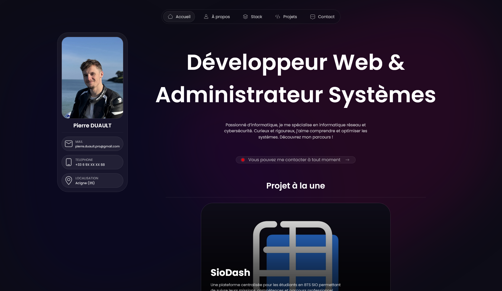
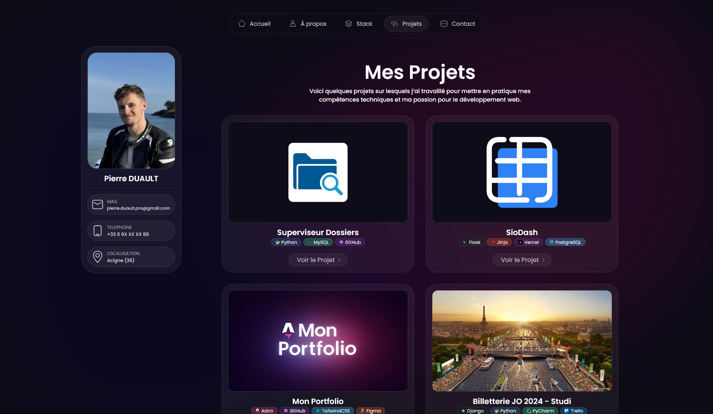
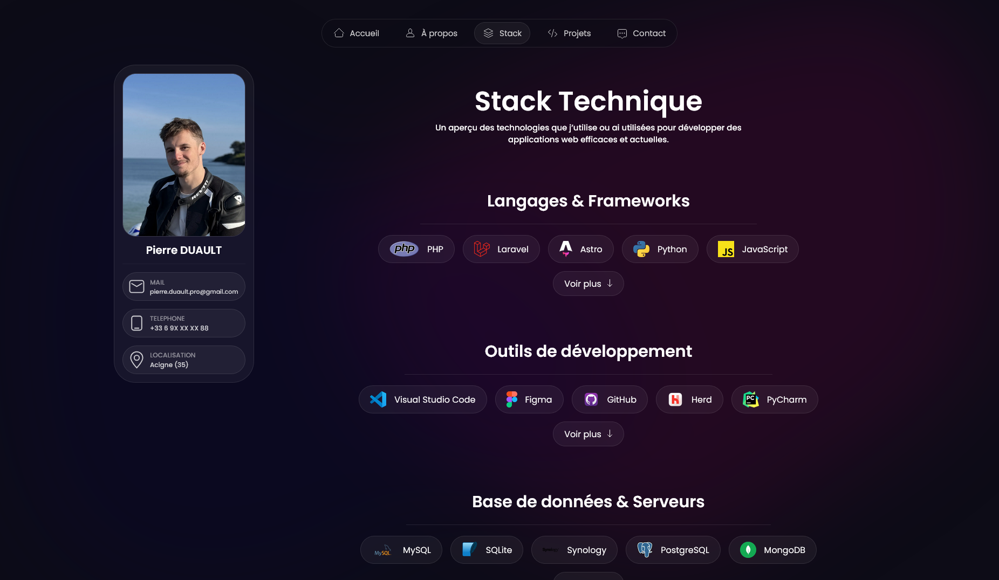

# Pierre Duault — Portfolio

[](https://pierre-duault.fr)
[](https://astro.build)
[](https://tailwindcss.com)

> Portfolio personnel de **Pierre Duault**, développeur web full stack & administrateur systèmes, basé à Rennes.
>
> Découvrez mes projets, mon parcours, ma stack technique et contactez-moi pour vos besoins en développement web.

---

## Apercu

### Accueil


### Projets


### Stack


---

## Fonctionnalites

- **Page d'accueil** — Presentation, carte de profil, projet mis en avant et formulaire de contact rapide
- **Projets** — Galerie de projets personnels et professionnels avec fiches detaillees
- **Stack** — Inventaire complet des technologies, outils et environnements maitrises
- **A propos** — Parcours, experiences professionnelles et formations
- **Contact** — Formulaire de contact fonctionnel
- **Pages legales** — Mentions legales, politique de confidentialite et CGU
- **SEO optimise** — Meta tags, Open Graph, Twitter Cards, sitemap
- **Design responsive** — Interface adaptee mobile, tablette et desktop (Tailwind CSS)

---

## Stack technique

| Categorie | Technologie |
|-----------|-------------|
| Framework | [Astro](https://astro.build) v6 |
| Styling | [Tailwind CSS](https://tailwindcss.com) v4 |
| Langage | TypeScript |
| Deploiement | [Vercel](https://vercel.com) |
| Domaine | [pierre-duault.fr](https://pierre-duault.fr) |

---

## Structure du projet

```text
/
├── public/               # Assets statiques (favicon, fonts, images, scripts)
├── src/
│   ├── assets/           # Images et logos (projets, stack, background)
│   ├── components/       # Composants Astro reutilisables
│   │   ├── icons/        # Icones SVG custom
│   │   ├── Card*.astro   # Cartes (projet, experience, formation, stack)
│   │   ├── navbar.astro
│   │   ├── footer.astro
│   │   └── ContactForm.astro
│   ├── data/             # Donnees statiques (experiences, formations, projets, stack)
│   ├── layouts/
│   │   └── Layout.astro  # Layout principal (SEO, meta, nav, footer)
│   ├── pages/            # Routes du site
│   │   ├── index.astro
│   │   ├── projects.astro
│   │   ├── stack.astro
│   │   ├── about.astro
│   │   ├── contact.astro
│   │   └── legal*.astro
│   └── styles/
│       └── global.css
├── astro.config.mjs
├── tailwind.config.js
└── package.json
```

---

## Commandes

Toutes les commandes s'executent depuis la racine du projet :

| Commande            | Action                                      |
| :------------------ | :------------------------------------------ |
| `npm install`       | Installe les dependances                    |
| `npm run dev`       | Lance le serveur de dev (`localhost:4321`)  |
| `npm run build`     | Build le site de production (`./dist/`)     |
| `npm run preview`   | Preview du build en local                   |
| `npm run astro ...` | Commandes CLI Astro (`add`, `check`, etc.)  |

---

## Deploiement

Le site est automatiquement deploye sur **Vercel** a chaque push sur la branche principale.

URL de production : [https://pierre-duault.fr](https://pierre-duault.fr)

---

## Auteur

**Pierre Duault** — Developpeur web full stack & administrateur systèmes

- Site : [pierre-duault.fr](https://pierre-duault.fr)
- Studio : Pi-Code Studio
